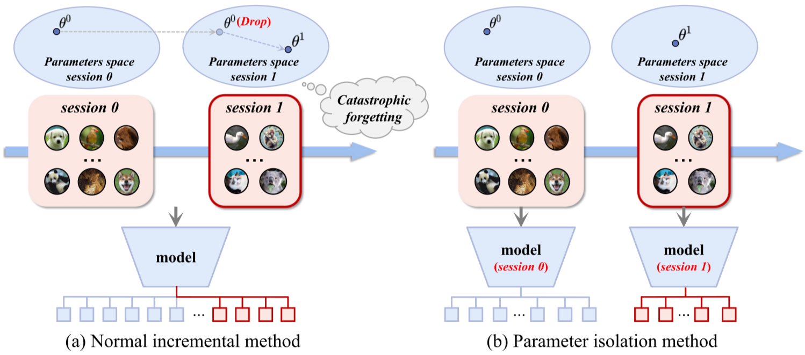
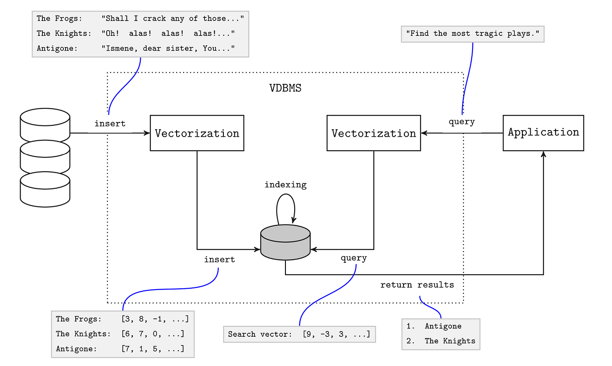
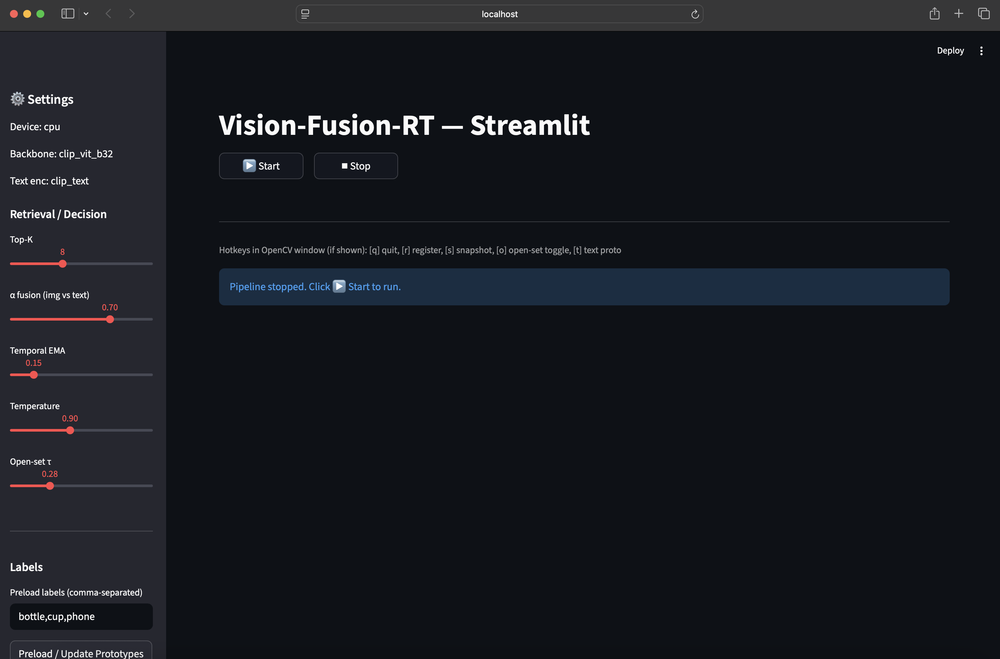
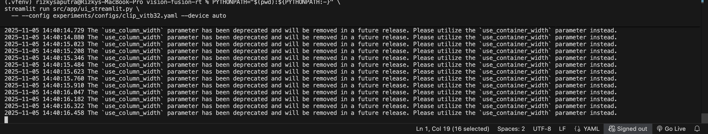

# 🎥 Vision Fusion Real Time (VFRT) — Real-Time Multimodal AI Based Clip Retrieval and Text Fusion System using Streamlit UI and OpenCV

## 📘 Overview
**Vision Fusion Real Time (VFRT)** is a **real-time retrieval** multimodial AI based demo that allows a **visual input** such as a **webcam** into a **CLIP-powered** object recognizer with a small, yet sufficient **self-growing memory** and adjustable **text-prototype fusion**. This real-time system introduces the concept of **data retrieval** without strictly relying on a **pre-trained** or **fine-tuned** model. This project is inspired with the recurring innovations of **facial recognition systems**, which is simultaneously linked to the project that I am currently working on. Furthermore, this demo ensures **reproducibility** as well as both a **research and practical based modularity** with the following specifications:

* 🔎 **Retrieve**: Encode frames → search FAISS memory → aggregate neighbor votes.
* 🧠 **Fuse**: Interpolate image scores with **CLIP-Text prototypes** (e.g., prompts like “a photo of a `{label}`”).
* 🧰 **Register on the fly**: Press `[r]` to capture a few recent frames and **add a new class**.
* 🧪 **Open-set handling**: Temperature and threshold for the **unknown**.
* ⚡ **Low-latency loop**: Threaded webcam which captures with a bounded queue and borders (e.g., “`latest-frame`” semantics).
* 🖥️ **Streamlit UI**: Start/Stop, sliders for fusion/EMA/temperature, live overlay preview.

> Designed to run on a **CPU** (works on *x86-64 Intel macOS/Linux* but is adjustable for *ARM MacOS/Windows*) or **MPS/CUDA** when available. Performance will scale with hardware. However, **MPS/CUDA** is preferred to ensure a smooth in real-time render and system execution.

<p align="center">        </p>

## 📁 Project Layout
```graphql
vision-fusion-rt/
├─ src/
│  ├─ app/
│  │  ├─ ui_streamlit.py      # Streamlit front-end
│  │  └─ main_rt.py           # Real-time orchestrator (loop, hotkeys, buffer)
│  ├─ core/
│  │  ├─ config.py            # Typed dataclass config + YAML loader
│  │  ├─ logging_utils.py     # Logger, timer, FPS meter
│  │  ├─ types.py             # Frame, RetrievalResult, typed records
│  │  └─ utils.py             # device, seeding, normalization helpers
│  ├─ io/
│  │  ├─ webcam.py            # Threaded, bounded-queue camera grabber
│  │  ├─ overlay.py           # OpenCV overlay (label, score, FPS)
│  │  └─ image_io.py          # PIL/BGR conversions, save helpers
│  ├─ memory/
│  │  └─ incremental.py       # Small FAISS-backed store + label registry
│  ├─ models/
│  │  ├─ backbones/
│  │  │  ├─ registry.py       # "clip_vit_b32" → CLIPVisionEncoder(...)
│  │  │  └─ clip_vision.py    # HF CLIP vision wrapper (encode_images)
│  │  ├─ text/
│  │  │  ├─ registry.py       # "clip_text" → CLIPTextEncoder(...)
│  │  │  └─ clip_text.py      # HF CLIP text wrapper (encode_text)
│  │  └─ heads/
│  │     └─ decision.py       # temperature + open-set thresholding
│  ├─ retrieval/
│  │  ├─ retriever.py         # kNN, label aggregation, text fusion, EMA
│  │  └─ fusion.py            # utilities (aggregate, top-k, fusion)
│  └─ ...
├─ experiments/
│  ├─ configs/
│  │  ├─ default.yaml
│  │  └─ clip_vitb32.yaml     # used in screenshots
│  └─ results/                # (ignored) snapshots, logs, artifacts
├─ .gitignore                 # tuned to keep the repo lean (no weights/caches)
└─ README.md
```

## 🧠 Purpose and Motivation
Modern multimodal models such as CLIP establish a **joint latent embedding** space where **images** and **text** can be directly compared using **vector similarity**. However, these models are often **static**, **offline**, and **not incrementally adaptive**. Real-world robotics, sensing, and real-time perception systems **do not operate in offline curated datasets**, rather they are required to adapt **online** as new objects appear, disappear, change lighting, orientation, texture, deformation, etc. Consequently, Vision-Fusion-RT was developed in order to solve this exact gap, where:

| Offline Foundation Models    | Real-Time Vision-Fusion-RT                   |
| ---------------------------- | -------------------------------------------- |
| Training-time fixed concepts | Open-world object addition at inference time |
| Model weights static forever | Memory-based continuously adaptive knowledge |
| Single modality dominance    | Fusion between text priors & visual memory   |
| Batch processing emphasis    | Frame-by-frame continuous reasoning pipeline |

The system uses **CLIP image/text alignment** and **not a classifier**. Rather, the system run as a **semantic coordinate system**. Furthermore, the system includes the following implementations:
* a **dynamic incremental memory store** (FAISS vector store).
* an **online few-shot registration mechanism**.
* a **retrieval and fusion scoring based pipeline** (kNN, text priors and EMA smoothing).
* a **real-time control loop** with camera → embedding → retrieve → decide → UI.

### Architectural Foundations
This system does not rely on a traditional machine learning (ML) pipeline like sklearn classification. Rather, it relies on a **Retrieval-Augmented (RAG) Vision Model architecture**. The model is structured under these primary architectures:

* **RAG for Vision**:


* **Open Vocabulary Object Recognition**:


* **CLIP Few-Shot Incremental Learning**:


* **Vector Store Based Online Recognition**:


## ⚒️ Architecture Overview
**Vision Fusion RT** is implemented with a strict yet adjustable modularity architecture as shown below:
| Layer                          | Responsibility                                                            |
| ------------------------------ | ------------------------------------------------------------------------- |
| **`io/webcam.py`**             | Threaded capture; bounded queue; “latest frame”; auto-reopen on hiccups.  |
| **`models/backbones/*`**       | CLIP vision encoder (HF) → `[N,d]` normalized embeddings.                 |
| **`memory/incremental.py`**    | FAISS store + small label registry (metas, centroids, counts).            |
| **`retrieval/retriever.py`**   | kNN search → neighbor aggregation → optional text fusion → EMA smoothing. |
| **`models/heads/decision.py`** | Temperature scaling + open-set thresholding.                              |
| **`app/main_rt.py`**           | Orchestrates loop, buffer for registration, hotkeys, text proto cache.    |
| **`app/ui_streamlit.py`**      | Streamlit controls, sliders, and live preview embed.                      |
| **`core/config.py`**           | Strict dataclass config + YAML + env/CLI overrides.                       |

> Add and replace the backbones or stores them by registering several new keys in `models/*/registry.py`.

## 🧭 Project Scope
### Objectives
* Build a **real-time retrieval system** that combines **CLIP vision embeddings** with a **text-prototype fusion**.
* Provide a **self-growing memory** (few-shot registration from webcam) with open-set rejection.
* Offer a **portable UI (Streamlit)** and a clean yet robust typed config system for **reproducible** runs.

### 🔍 In Scope
* **Real time webcam pipeline**: Threaded capture, latest-frame semantics, FPS meter and snapshots.
* **Embeddings and retrieval**: CLIP vision encoder → FAISS k-NN → neighbor aggregation (*mean* / *max* / *sum* / *median* / *softmax*).
* **Text fusion**: CLIP text prototypes + α-interpolation with image scores.
* **Decision head**: Temperature scaling with a configurable open-set threshold.
* **On-the-fly registration**: Press `[r]` to add classes from recent frames (Simple metadata and label centroids).
* **Config & overrides**: YAML, CLI and environment (`VFRT_*`) with validation.
* **Defaults and Examples**: working config for `Vision-Fusion-RT/clip-vit-base-patch32` on **CPU/MPS/CUDA**.

### 🗺️ Out of Scope (Possible Roadmaps)
* Full model training/fine-tuning or dataset management.
* Large-scale vector DB ops (sharding, replication, Milvus ops, etc.).
* Production UX (multi-camera routing, auth, web deployment).
* Perfect accuracy in unconstrained environments.

### 📍 Assumptions
* CLIP image and text spaces are aligned (same encoder family).
* Reasonable lighting and object scale within the specified frame.
* **PyTorch 2.6+** with a **HuggingFace (HF)** safeguard for `torch.load` and FAISS with AVX2 on an x86 environment (Adjustable to other OS configurations).

### 🚚 Deliverables
* Source code for the app (`main_rt.py`), Streamlit UI, FAISS memory, retrieval/fusion and decision head.
* Configs (**YAML**) with a tested sane defaults.
* `README.md` with quickstart, troubleshooting and extensibility notes.
* `.gitignore` tuned to maintain the repo (no unnecessary loading of *weights* / *caches* /*results*).

## 🚀 Environment & System Execution
It is recommended to setup the environment using **Python 3.9 - 3.10**. In addition, **macOS** or **Linux** provides the optimal execution for the specified (**Vision Fusion RT**) model. The setup and primary executable is shown below:
```bash
# 1 - Create venv
python3 -m venv .vfenv
source .vfenv/bin/activate

# 2 - Install deps (PyTorch 2.6+ is required by HF due to CVE-2025-32434)
pip install --upgrade pip
pip install -r requirements.txt

# 3 - Run Streamlit UI
PYTHONPATH="$(pwd):${PYTHONPATH:-}" \
streamlit run src/app/ui_streamlit.py -- \
  --config experiments/configs/clip_vitb32.yaml --device auto
```

## ⚜️ Streamlit Deployment
After running the Streamlit UI, the following Vision Fusion RT system will be redirected to a **localhost** (*adjustable host*) and display the UI page with its keys, sliders and camera display after clicking the start button as shown below.

### 🛜 Streamlit Localhost UI


### 🛜 Streamlit Camera Display


### 📶 Terminal Sample


### 🔑 UI hotkeys (OpenCV window)
There are several keys that is crucial when running or simulating the real-time system. Here are the implemented ones:
* **Quit**: `[q]` 
* **Register**: `[r]`
* **Snapshot**: `[s]`
* **Toggle open-set**: `[o]`
* **Add/refresh text prototypes**: `[t]`

### 🎚️ Panel Sliders
* **Top-K (neighbors)**
* **α fusion(img vs text)** — `0.0` = only text, `1.0` = only image
* **Temporal EMA** — smoothing for scores (`0` disables)
* **Temperature** — softening for decision head
* **Open-set threshold** — higher → stricter unknown

## ⚙️ Configuration (YAML → Dataclasses)
The dataclasses was initialized in `src/core/config.py` and defines the strictly-typed configs as follows:
```yaml
# experiments/configs/clip_vitb32.yaml
device: "auto"                    # "cuda" | "mps" | "cpu" | "auto"
seed: 42
backbone: "clip_vit_b32"
text_encoder: "clip_text"
img_size: [224, 224]
normalize: "clip"

memory:
  backend: "faiss"
  metric: "ip"
  index_spec: "Flat"
  nprobe: 16
  persist: true
  persist_dir: "data/registries"

retrieval:
  k: 8
  fuse: "late"
  alpha_fusion: 0.7
  neighbor_agg: "mean"
  temporal_ema: 0.15
  score_norm: "none"

decision:
  open_set_threshold: 0.28
  temperature: 0.90

rt:
  cam_device: 0
  cam_size: [640, 480]
  cam_fps: 30
  max_queue: 4
  drop_frame_on_backlog: true
```
> It is possible to override via **env** (e.g., `VFRT_DEVICE=cpu`) or **CLI** (`--device mps --fps 60`).


## 🖱️ Live Registration Workflow
The registration workflow is configured with these following steps:
* **Preload labels** in the **Streamlit UI** text box (e.g., *bottle*, *cup*, *phone*).
* **Click Start** to allow the webcam to turn on and access the real time detection.
* **Aim the object** into the webcam. Thus, ensure that this object is **large** (at least visible for the camera input) and **visually visisble** (**avoid an overly dark or bright environment**).
* Press `r` to be prompted for a **label** (or use `--reg-label`).
* Let the **last N frames** (configurable) to be **encoded and stored**.
* **Retrieval** should now **vote** for the label (unless the open-set threshold rejects).
* If it returns **unknown (0.00)**, make sure to recondition the project environment or expand more labels for an in-depth recognition. Otherwise, revert to the **troubleshooting section**.

## 📊 Real-Time Display
The Streamlit UI will return a real-time display with the following layout and its descriptions:
* **Overlay (left)**: The raw OpenCV stream with a banner `top_label (score)` and `FPS`.
* **Stats (right)**: The current label, a score bar, and a numeric FPS readout.
* When no confident label passes threshold, **“unknown”** is shown.

## 🏎️ Performance Notes
* **CPU-only device** runs the system in a **slow** rendering rate due to the **sub-FPS**. Thus, it is recommended to use **MPS (Apple GPU)** or **CUDA** if available.
* Keep the **image size** at 224 for speed purposes. However, adjust if necessary.
* **Queue draining** keeps "*latency flat*" by **dropping stale frames**. However, note that **FPS** may still be low on weak CPUs.
* Reduce **Top-K** and turn off **EMA** to save computational resource or power.
* **Text fusion** adds a small cost. Thus, start with `α ≈ 0.7` for more images and adjust if necessary.


## 🧪 Reproducibility
In order to ensure the reproducibilty, the **Vision Fusion RT** system has a flexible and discrete categorization on the detactable object oriented labels. These configurations were implemented and executed as shown below:
```bash
# Force CPU for portability
streamlit run src/app/ui_streamlit.py -- --config experiments/configs/clip_vitb32.yaml --device cpu

# Preload labels & default registration label
streamlit run src/app/ui_streamlit.py -- --config experiments/configs/clip_vitb32.yaml \
  --init-labels "bottle,cup,phone" --reg-label "bottle"

# Larger camera frame (if your device supports it)
streamlit run src/app/ui_streamlit.py -- --config experiments/configs/clip_vitb32.yaml \
  --size 1280 720 --fps 30
```
> Hereby, it is recommended to expand the number of labels to ensure a more robust system.

## 🔧 Developer Guide
### 🩻 New Backbone Addition
The inclusion of a new backbone is set through the implementation of a thin wrapper exposing `encode_images([...]) -> np.ndarray [N,d]` (**L2-normalized**). Thereafter, Register it in **models/backbones/registry.py** as such:
```python
BACKBONE_BUILDERS["my_backbone"] = lambda device="cpu", **kw: MyBackbone(device=device, **kw)
```

### 🖋️ New Text Decoder Addition
Afterwards, a new text decoder is added alongside the recently implemented backbone with the following:
* Expose the `encode_text([...]) -> np.ndarray [M,d]` that is **aligned** with its vision space.
* Register as `"my_text"` inside `models/text/registry.py`.

### 🎞️ Memory Store Swapping
`IncrementalMemory` uses **FAISS** as "*Flat*” by default. Thus, it is recommended to swap the index (e.g., **IVF**,**PQ**) or implement a customized router system to ensure a smooth run on the **Streamlit UI**.

## 🧰 Troubleshooting
Throughout the development of this particular system, there were several issues that was encountered. Thus, a set of troubleshooting reminders and solutions are listed as follows: 
* 🔴 **TypeError: unhashable type: 'dict'**
    * The dict was passed when its string key was expected (e.g., `cfg.backbone` should be `"clip_vit_b32"`). 
    * Use the **provided YAML** and do not overwrite with nested dicts in the UI/CLI.
* 🟠 **Torch 2.6+ requirement**
    * **HuggingFace (HF)** checks for **CVE-2025-32434** and blocks `torch.load` on older versions of Torch. 
    * Upgrade to **PyTorch 2.6+** in a **venv** to prevent this persisting issue.
* 🟡 **urllib3 LibreSSL warning on macOS**
    * Informational reminder. (Inevitable)
    * Network system still works (Just ignore these warnings if there are no errors following up)
* 🟢 **Webcam green LED blinking but UI is blank**
    * The OpenCV preview might be behind the Streamlit page (it spawns a native window). Look for a new window titled `Vision-Fusion-RT — ....`
    * If you only see the Streamlit page, ensure no other app is holding the camera.
    * The webcam thread drops old frames by design; that’s why the LED can blink while UI looks static if the loop is overloaded (CPU). Reduce load (Top-K↓, EMA=0, α≈0.7).
* 🔵 **Constant “unknown (0.00)**”
    * You likely haven’t registered any labels yet. Press r and add e.g., bottle.
    * Or your open-set τ is too high. Lower it (e.g., 0.15–0.25) and try again.
    * Poor lighting → CLIP features degrade. Increase lighting / object size.
* 🟣 **FPS Displaying 0.0**
    * The FPS meter updates once per loop; on slow CPUs you’ll see ~0.0–1.0. That’s okay.
    * Verify the OpenCV window is refreshing (it’s the ground truth).

## 🧼 Repo Files Management
This repo ships with a strict .gitignore (models, FAISS indexes, results, caches) module which maintain its configs (experiments/configs/*.yaml) due to their small size and essential role in the specified Vision Fusion RT system. In the case where large files are added, please execute the following commands in order to avoid pusshing unnecessary files:
```bash
git rm -r --cached .
git add .
git commit -m "clean: drop weights/caches and use .gitignore"
```


## 🛣️ Future Work and Roadmaps
In order to further enhance the implementation of the **Vision Fusion RT** mulimodal system, several plausible future innovations were established as shown below:
* **IVF/PQ FAISS indices and on-disk persistence**.
* **On-screen label editor and per-label undo**.
* **Batch evaluation scripts and CSV metrics**.
* **Alternative backbones (e.g., SigLIP, EVA-CLIP)**.
* **WebRTC camera for remote browser demo**.

## 👤 Author and Credentials
This project is fully established and contributed by the following author:
* **Name**: Rizky Johan Saputra
* **Institution**: Independent
* **Role**: Project Developer, Manager and Author
* **Education**: Undergraduate at Seoul National University (Enrolled at 2021, Graduating in 2026)
* **Project Scope**: Computer Vision, Real-Time Systems, Interactive AI System, Deep Learning, Machine Learning, CLIP based Embeddings and Memory Augmentation.

## 📜 License
This repository is distributed under an Independent Personal License tailored by the author. See `LICENSE` for the full terms. For further inquiries and requests, please contact via GitHub or Email only.
> If you intend to reuse significant portions for research and academia purposes, please open and inquire an issue to discuss attribution and terms. 

## 🧷 Appendix
### ⌨️ Keyboard Dynamics
`[q]` quit · `[r]` register class · `[s]` snapshot · `[o]` toggle open-set · `[t]` text proto update

### 🏷️ Robust Sample Settings (CPU)
* `Top-K = 5–8`
* `α fusion = 0.6–0.8` (**Favor image**)
* `EMA = 0.1–0.2`
* `Temperature ≈ 0.9`
* `Open-set τ = 0.20–0.30`
* **Good lighting and object fills ~1/3 of frame**
##

# <p align="center"><b>⏳ Real-time synthesis between what you see and what language understands 💡</b></p>